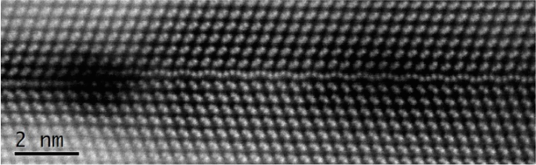
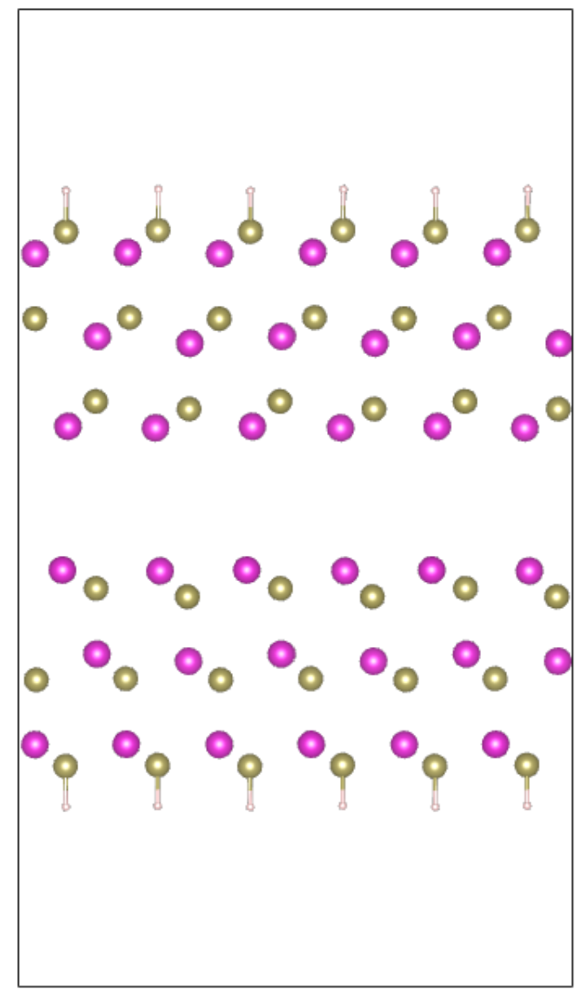
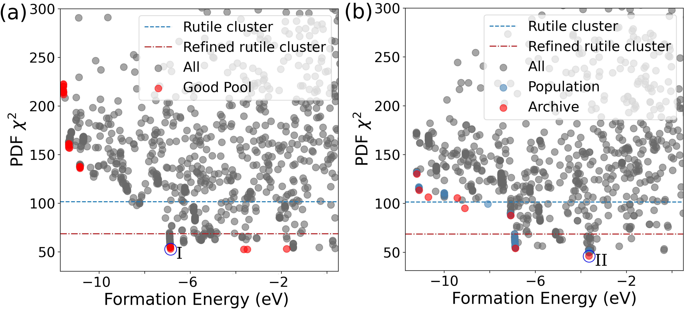
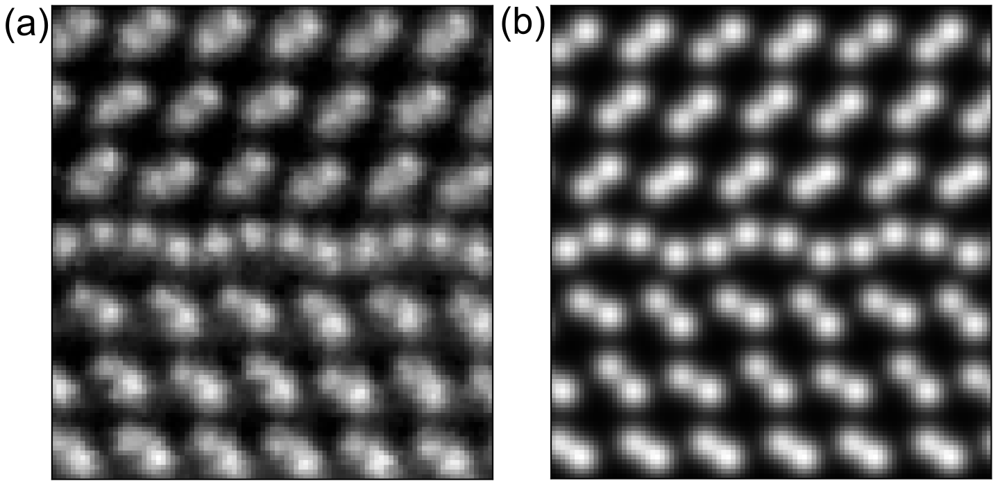

# Grain boundary structure search: a TEM example

## Grain boundary search

FANTASTX grain boundary (gb) geometry search investigates multiple grain boundary structures to find the best-matched interface structure. In this search, the atomic configuration of the grains on both sides of the boundary are kept fixed, taken from a reference structure. The atomic configuration of these reference grains can be determined either by hand, or by using the [Ingrained](https://github.com/MaterialEyes/ingrained-lite) package.

With the grains fixed, only the configuration of the interface is subject to the search process. The interface is frequently non-stoichiometric, subject to strain induced defects, vacancies, and other defects which make capturing the configuration difficult. This necessitates the use of an approach such as the evolutionary algorithm approach of FANTASTX.

Currently FANTASTX supports the following genetic operations for grain boundaries:

1. Basin hopping (the *perturb_sites* operator)
2. Cut-and-splice mating (the *fraction_slice* operator)
    a. Same fingerprint cluster cut-and-splice mating (*fraction_slice_same_cluster*)
    b. Different fingerprint cluster cut-and-splice mating (*fraction_slice_dif_cluster*)
3. Compositional mutation (the *perturb_comp* operator)

While grain boundary search in principal works with any of the experimental methods that FANTASTX supports, and can also be conducted using energy-only (single objective) search, only one of these experimental methods is commonly used to investigate grain boundaries: transmission electron microscopy (TEM).

## TEM forward simulations

TEM is an excellent experimental method for directly observing the atomic structure of materials, with atomic resolution. In the case of grain boundaries, an experimental TEM image captures the orientation of both the grains correctly. However, in the interface region the more stochastic nature of the atomic configuration renders even the atomic resolution of TEM insufficient for decisive insight into the atomic configuration of the interface. It is only by matching images produced from forward TEM simulations to the experimental image that a proposed atomic configuration can be validated. FANTASTX utilizes Earl J. Kirkland's [incostem](https://github.com/jhgorse/kirkland) program to conduct these TEM simulations, wrapped by the [Ingrained](https://github.com/MaterialEyes/ingrained-lite). For technical details beyond the YAML input parameters which are needed to conduct TEM simulations using FANTASTX, which will be covered [later](#tem_yaml_inputs) in this example, please refer to the Ingrained documentation.

The metric which is used to quantify the similarity between the simulated and experimental images is the [structural similarity index](https://scikit-image.org/docs/dev/auto_examples/transform/plot_ssim.html).

## Example

In this example, we will use FANTASTX to invert an experimental TEM image which corresponds to two CdTe grains with a monolayer of Tellurene in the interface. The reference image can be found in [this](https://pubs.rsc.org/en/content/articlelanding/2019/nr/c9nr02342a) publication. 

<p style="text-align:center;"></p>

### Preparation

#### Trimming the experimental image

The first step is to decide what portion of the image will be used for active structure search. If the whole experimental image will be used for the structure search, then no editing is needed. If only a subportion of the image will be used, then the image must be trimmed down to the active region before proceeding. This can be done easily using the image_ops module from [Ingrained](https://github.com/MaterialEyes/ingrained-lite). 

For instance, in this case we observe that the structure exhibits periodicity along the interface. As such, to minimize computational effort, we will focus on a small slice of the image. In the following piece of code the larger PNG is read in to Ingrained, and then a roughly 100x100 pixel patch is saved into a numpy object for later use:

```python
from ingrained import image_ops
import os
import numpy as np

png_file = os.getcwd() + "/" + "tellurene.png"
npy_file = os.getcwd() + "/" + "tellurene.npy"
raw_pixel_values = image_ops.image_open(png_file)
np.save(npy_file, raw_pixel_values['Pixels'][42:142, 246:340])
```

#### Obtaining the atomic configurations of the grains

The second step is to determine the atomic configuration of the two grains on the sides of the interface. This can be done in two ways:

* Apply [Ingrained](https://github.com/MaterialEyes/ingrained-lite)
* Manually align the grains

In this case, as the grains are simple CdTe layers, we can assemble them manually, capping the layers with H on either side (though fixing the outer atoms renders this step not strictly necessary).

<p style="text-align:center;"></p>

These atomic positions were aligned as closely with the experimental image as possible, translating them in the x, y and z directions using the atomic visualization program that was employed (Vesta). It was then saved in the VASP POSCAR format for input to FANTASTX. If the grains were more complex, then Ingrained would have been employed. It can also be noted that the interface is periodic in the x-y plane, and finite along the z-axis. This is required for FANTASTX integration.

!!! note
    Currently FANTASTX only supports grain boundaries where the interface regions have lattice angles that are all $90^{\circ}$. This means that the reference structure must also have a lattice with lattice angles that are all $90^{\circ}$.

#### Creating the energy optimization input files

The third step is to decide what method will be used to relax the candidate structures and measure their formation energies. As mentioned [elsewhere](), FANTASTX currently supports both LAMMPS and VASP. 

If using LAMMPS, then the LAMMPS input file must be provided in the directory linked to in the YAML file (under **energy_files_path**), and must be named **in.min**. The user must also provide file(s) for the interatomic potential or force field, but these are not copied into the calculation's relax directory, and can be located anywhere accessible in the filesystem. Instead, the path to the potential inside the input file must be complete and not a relative path.

If using VASP, then the VASP INCAR, KPOINTS, and POTCAR files must be provided. The POTCAR files must be named POTCAR_(element name 1), POTCAR_(element name 2), etc. For instance, when running a calculation with Cd and Te, two POTCARS must be provided, POTCAR_Ir and POTCAR_Te.

In this case, we will be using VASP.

#### Determining the Ingrained STEM parameters

The next step is to determine the STEM simulation parameters, fed into the [incostem](https://github.com/jhgorse/kirkland) program via [Ingrained](https://github.com/MaterialEyes/ingrained-lite). Several STEM parameters can be tuned, but here we focus on a sparse selection of parameters:

1. **The pixel size**
2. **The interface width**
3. **The STEM defocus**

The pixel size determines the number of pixels in the final image. This setting is tuned to match the size of the simulated image. Here, we set it to be **0.26**. 
The interface width allows additional stretching the interface region. Here we do not do this, we instead set this parameter to be **0**.
Finally, the defocus tunes the resolution of the simulated image. Through a brief optimization routine, we find the optimal setting to be **1.67**.

The output of the ingrained STEM simulations is an image which only has 1 channel, so to compare against the experimental image we flatten the experimental image into 1 channel by averaging the 4 channels. Below is sample code which compares a simulated image against the experimental image.

```python
from ingrained.structure import Bicrystal

opt_params = [0.26, 0, 1.67]

bicrys_model = Bicrystal(poscar_file='CdTe_grain_POSCAR')
sim_img, __ = bicrys_model._get_image_cell(pix_size=opt_params[0], interface_width=opt_params[1],
                                           defocus=opt_params[2], view=False)
sim_img = sim_img[32:132]

exp_prev = np.load('images/tellurene_sliced.npy')
exp_prev = np.mean(exp_prev, axis=2)[:,1:] # flatten the numpy image to only have 1 channel
match_ssim = image_ops.score_ssim(sim_img, exp_prev)
```

#### Preparing the YAML input file

The final step is the preparation of the YAML input file. A complete guide to the preparation of FANTASTX YAML input files can be found [here](). 

##### Grain boundary YAML inputs

In this case, as we are running a grain boundary structure search, our YAML must include distinct information pertinent to grain boundaries. Under the **structure_record** keyword, a subsection titled **gb** must be included which provides all grain boundary specific structural information:

```YAML
structure_record:
    gb:
        init_gb_astr: PATH/TO/GB/POSCAR
        iface_thickness: 6.0
        iface_z_mid: 0.500
        num_slices: 2
```

The **init_gb_astr** keyword specifies the path to the POSCAR which corresponds to the initial structure whose grains will be used for the structure search process. Here we set the interface thickness to be 6 angstroms.

The **iface_thickness** keyword specifies the width of the interface in the z-direction in units of angstroms. Similarly, the **iface_z_mid** keyword specifies the midpoint of the interface in the z-direction by its relative coordinate. Here we set the midpoint of the interface to be the middle of the unit cell.

The **num_slices** keyword determines how many slices are made when employing the cut-and-splice operator for mating. These slices are spliced together in an alternating fashion. For instance, if the number of slices is 3, two slices from parent one will sandwich a slice from parent two.

Additionally, if fingerprinting structures and conducting structural comparison to quantify the similarity of each structure, it is useful to constrain the fingerprinting region of grain boundary geometries to contain only the interface region and perhaps a single atomic layer on each side of the interface. This can be done by adding a **zbounds** keyword to the **fingerprint_params** section of the YAML:

```YAML
fingerprint_params:
    label: "bag-of-bonds"
    tolerance: [0.02, 0.7]
    zbounds: [15.91, 27.09]
```
Here the **zbounds** keyword specifies the lower and upper z-coordinate limits for referencing atomic positions when constructing a fingerprint.

##### <a id='tem_yaml_inputs'></a>TEM YAML inputs

In addition to grain boundary specific inputs, our YAML file must also include inputs specific to (S)TEM simulations:

```YAML
exp_sim_1: "GB_STEM"
exp_sim_1_params:
    progress_file: null # or PATH/TO/PROGRESS/FILE
    ing_opt_params: [0.26, 0, 1.66938749, 1, 1, 1, 1, 1, 1, 1]
    dm3_path: PATH/TO/DM3/FILE
```

The **exp_sim_1** keyword tells FANTASTX what kind of experimental simulation is being employed. Here of course we use the "GB_STEM" keyword since we are running (S)TEM simulations to compare to experimental TEM data. 

!!! note
    Currently FANTASTX only supports TEM experimental image inversion for grain boundary geometries, since these geometries are by far the most frequent use case for structure search involving TEM data. If you have need to perform TEM structure search for a non-grain boundary geometry, please reach out to the FANTASTX team and we can work on incorporating it into the code.

The **progress_file** keyword (under **exp_sim_1_params**) tells FANTASTX where to find the Ingrained file that was generated while it was constructing the grain boundary configuration. This file contains the optimal set of TEM simulation parameters that were found by Ingrained.

Alternately, these optimal simulation parameters can be provided directly using the **ing_opt_params** keyword. If the **progress_file** keyword is not provided, then this keyword MUST be provided, otherwise FANTASTX will be unable to proceed.

The **dm3_path** keyword provides the path to the dm3 file corresponding to the experimental TEM image. If not provided, then FANTASTX will check for the existence of a hard-coded reference file located at 'inputs/whole_exp.npy', which is useful if the user wants to provide a numpy array image taken from a non-dm3 reference file (see above for an example of generating such a numpy array using ingrained). If this file is also not found, then FANTASTX will be unable to proceed.

!!! note
    Here all of these inputs are provided using the exp_sim_1 keywords (**exp_sim_1** and **exp_sim_1_params**) since we are only employing one experimental simulation method. If we were employing an additional experimental reference, then either those simulation params would be provided under the exp_sim_2 keywords or the STEM inputs would be moved to exp_sim_2.

<!-- #### <a id='example_input_file'></a>Full YAML file -->

!!! example "Full YAML file"

    This full YAML file for this example contains other information relevant to the specific atoms (Cd and Te), population information for the structure search, basinhopping constraints, fingerprint and clustering parameters, and inputs to the selection algorithm. Additionally, it includes the inputs to Dask for parallelizing the FANTASTX run, here set up to run on LCRC at Argonne National Laboratory. For preparing each of these sections, refer to the [YAML preparation](../YAML_PREP) section of the documentation.

    ```YAML
    inputs:
        energy_files_path: PATH/TO/VASP/FILES

    structure_record:
        gb:
            init_gb_astr: PATH/TO/GB/POSCAR
            iface_thickness: 6.0
            iface_z_mid: 0.500
            num_slices: 2
            hop_mate_frac: 0.4

        max_bond_dist: 4
        min_dist:
            sp1_sp1: 2.1 # calculated as 2*(covalent radii)
            sp1_sp2: 2.4 # calculated as sum of covalent radii
            sp2_sp2: 2.5 # calculated as 2*(covalent radii)
        species:
            species1:
                name: Cd
                min_num: 0
                max_num: 0
                mu: -1.834 # Te-rich
            species2:
                name: Te
                min_num: 3
                max_num: 5
                mu: -3.143 # Te-rich
            species3:
                name: H
                min_num: 0
                max_num: 0
                mu: -1.116967

    population_limits:
        initial_population: 30
        total_population: 300
        pool: 50

    energy_code: vasp
    energy_exec_cmd: mpirun -np 36 vasp_std > vasp_job.log

    exp_sim_1: "GB_STEM"
    exp_sim_1_params:
        progress_file: null
        ing_opt_params: [0.26, 0, 1.66938749, 1, 1, 1, 1, 1, 1, 1]
        dm3_path: null

    cluster_params:
        type: "hierarchical" # hierarchical or compositional
        distance_calculation: "fingerprint" # options are "fingerprint" and "xsim"
        linkage_method: "ward" # only required for hierarchical clustering
        cutoff_type: "inconsistent" # only required for hierarchical clustering. "distance", "inconsistent", or "maxclust_monocrit"
        max_clusters: 10 # only required for hierarchical clustering. Maximum number of flat clusters created
        min_clusters: 1 # only required for hierarchical clustering. Minimum number of flat clusters created
        max_incons_cutoff: 5.0 # only required for hierarchical clustering. Maximum inconsistency threshhold
        max_dist_cutoff: 2.0 # only required for hierarhcical clustering. Maximum distance threshhold
        min_cluster_occupancy: 4 # only required for hierarchical clustering. Minimum desired occupancy of each cluster

    basinhopping_constraints:
        max_perturbation: 0.5

    fingerprint_params:
        label: "bag-of-bonds"
        tolerance: [0.02, 0.7]
        zbounds: [15.91, 27.09]

    select_params:
        selection_algorithm: epsilon_moea
        epsilons: [0.3, 0.15]
        objective_fn_type: multi
        operators: [
                "perturb_sites",
                "fraction_slice_dif_cluster",
                "fraction_slice_same_cluster",
            ]
        operator_assignment: "fixed"
        operator_frequencies: [0.45, 0.275, 0.275] # make sure add up to 1, and has same length as 'operators'. Should be [0.87, 0.13] for original gb implementation.

    workers:
        cluster: "SLURM"
        submit_queue: "bdwall"
        max_workers: 10
        num_cores: 1
        total_mem: "120GB"
        project_name: "XRS_FANTASTX"
        node_type: "ib0"
        walltime: "48:00:00"
        processes: 1
        env_extra: null
        job_extra: # any other PBS/SLURM submit options
            - "--nodes=1"
        header_skip:
            - "-c "
    ```

### Results

See [this](CdTe_Tellurene_Analysis.ipynb) notebook for a guide on how to run the visualization of the results for this example. The objective plot corresponding to this example, comparing the formation energy and SSIM score of each configuration, is visualized below.

<p style="text-align:center;"></p>

The best structure found, here highlighted in red as the sole member of the $\epsilon$-MOEA archive, has both the lowest energy and lowest mismatch with experiment. This is an example where multi-objective optimization reliably accelerates the search process, but does not help find multiple candidate solutions, as here no Pareto front exists to sample solutions along. The best structure found is certainly the target structure, as can be observed above when comparing the experimental and simulated image side-by-side. 



Here panel (a) corresponds to the experimental interface, and panel (b) corresponds to the simulated interface. 