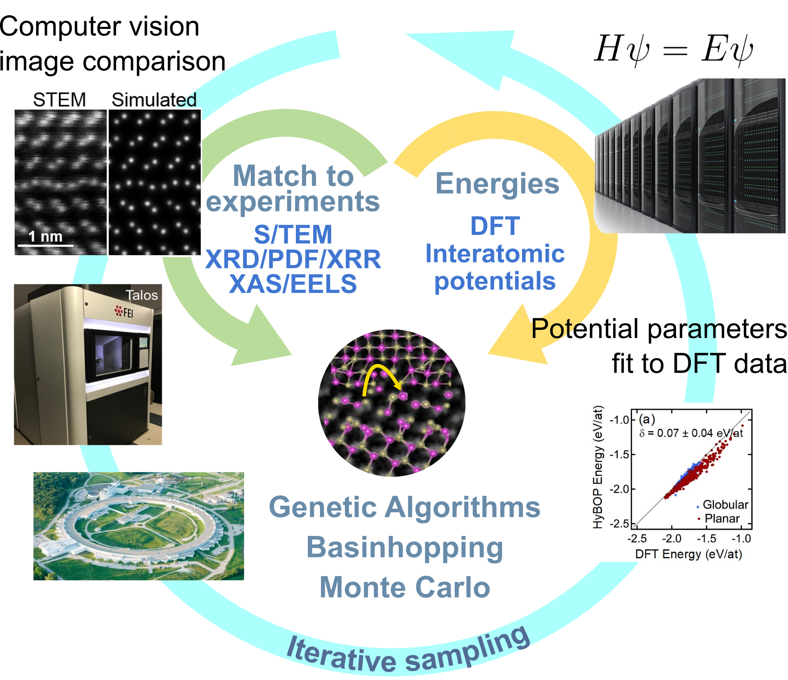

# FANTASTX - Fully Automated Nanoscale To Atomic Structure from Theory and eXperiments

FANTASTX is an automated spectra-to-structure inversion code. Taking experimental spectroscopy or microscopy characterization data as input, FANTASTX searches for candidate atomic configurations which are both physically plausible and realizable. FANTASTX interfaces with classical molecular dynamics simulations codes and density functional theory codes to perform structural relaxation and measure the potential energy of each configuration, using the total or formation energy as an objective function. It also interfaces with various simulation codes to perform forward simulations of spectroscopy and microscopy experiments, using the quantified mismatch between the simulated data and the experimental data as another objective function. The fitness of each proposed atomic configuration is assessed on the basis of one or more of these objectives. 

Automated structure search is conducted by employing an evolutionary algorithm approach. FANTASTX constructs an initial population of candidate atomic configurations from user provided structures or FANTASTX-generated random configurations, and evaluates the fitness of each of these configurations using the methodology described above. Genetic operations are then employed to create new child configurations from this initial population, choosing parents using one of FANTASTX's implemented evolutionary selection algorithms. 

 Overview of the FANTASTX methodology 

### Capabilities

FANTASTX is currently capable of interfacing with the following experimental data sources:

- **Transmission electron microscopy (TEM)**

- **Scanning tunneling microscopy (STM)**

- **X-ray absorption microscopy (XAS)**, specifically **x-ray absorption near-edge structure (XANES)** and **x-ray transient absorption (XTA)**

- **Pair distribution function (PDF)**

- **X-ray diffraction (XRD)**

FANTASTX currently supports structure search for a host of structural archetypes, using a variety of genetic operators. The structural archetypes that FANTASTX supports, as well as the genetic operators available to each one, are listed in the table below.

| Structural Archetype | Basinhopping     | Composition Perturbation | Mate-by-slice    | Mate-by-swap     |
| -------------------- | ---------------- | ------------------------ | ---------------- | ---------------- |
| `Bulk`               | :material-check: | :material-check:         | :material-check: | :material-check: |
| `Cluster`            | :material-check: | :material-check:         | :material-check: | :material-check: |
| `Molecule`           | :material-check: | :material-check:         | :material-close: | :material-check: |
| `Grain Boundary`     | :material-check: | :material-check:         | :material-check: | :material-close: |
| `Surface`            | :material-check: | :material-check:         | :material-check: | :material-close: |

FANTASTX also supports a variety of selection algorithms for choosing parent configurations to mate or mutate. These are:

1. **Distance-from-Pareto**: the convex hull surrounding the set of configurations in objective function space is calculated as line segments connecting the Pareto-optimal points, and the fitness of each configuration is determined based on an exponential scaling of the distance from the configuration to the nearest convex hull line segment in the direction of the convex hull.
2. **$\epsilon$-MOEA**: two parallel sets of configurations are maintained. The archive, which consists of the non-dominated configurations but discretized such that only one configuration from each $\epsilon$ box in objective space is kept (keeping the configuration closest to the optimal corner of the $\epsilon$ box), and the population, a fixed number pool of the remaining configurations (updated via replacement). Parents are chosen by selecting one model at random from the archive, and the non-dominated model out of two models chosen from the population. 
3. **Cluster Selection**: each atomic configuration is assigned a structural fingerprint (a tensor representation of the structure which is invariant to euclidean transformations or coordinate permutations), which are then used to cluster the configurations. Each configuration is then assigned a fitness based on its non-domination rank within its cluster, with each cluster assigned the same base fitness as every other cluster.

### Usage
The FANTASTX workflow is entirely automated. The only necessary inputs are the experimental data which is the target of inversion, input files for the chosen structural relaxation code, and a YAML file which provides FANTASTX with necessary variables. Several examples of using FANTASTX are contained within this documentation, and can be found [here](examples).