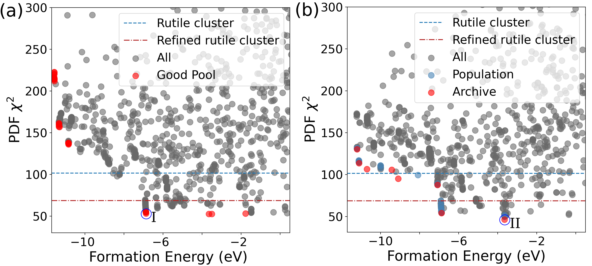

# Bulk structure search: a PDF example

## Bulk structure search

FANTASTX bulk structure search investigates structures which are periodic along all three lattice vectors. These can be crystalline or amorphous configurations (though amorphous configurations should contain enough atoms to account for unphysical periodicity). Importantly, the FANTASTX implementation of bulk structure search does not require a fixed box, unit cells are allowed to vary in orientation and volume. 

Currently FANTASTX supports the following genetic operations for both fixed and variable unit cell bulk geometries:

1. Basin hopping (the *perturb_sites* operator)
2. Cut-and-splice mating (the *fraction_slice* operator)
    a. Same fingerprint cluster cut-and-splice mating (*fraction_slice_same_cluster*)
    b. Different fingerprint cluster cut-and-splice mating (*fraction_slice_dif_cluster*)
3. Compositional mutation (the *perturb_comp* operator)
4. Mate-by-swap (the *mate_by_swap* operator)

These genetic operators have been fine-tuned to accomodate variable cell geometries. For details on their implementation, refer to the FANTASTX [paper]().

It should be noted that bulk geometries are not compatible with every experimental simulation method that FANTASTX supports. Only simulation methods capable of probing the interior of a structure can be utilized, such as PDF or XAS. Methods which interact with the surface of a structure, such as STM or TEM, are not compatible. 

It also worth noting the methodology with which FANTASTX constructs random bulk configurations (used to populate the initial pool in the absence of provided configurations). Configurations are constructed by starting with a single atom in an empty simulation cell. New atoms are then added to the atom(s) already in the simulation cell as bonded neighbors, daisy-chaining out from the initial atom, albeit with the ability to branch off and bond to any other atom in the simulation cell instead of just the most recently added atom. New bonds are prevented if it would exceed the bond limit of the target atom, and new bonds are added preferentially as far away from current bonds as possible.

## PDF forward simulations

Pair distribution function (PDF) analysis is an experimental method which is capable of probing structural order within the bulk of a material. The output of PDF analysis is the distance correlation of consituent atoms within the material, yielding insight into both nearest-neighbor and next-nearest neighbor bonding configurations in addition to higher order structural correlations. Typically these correlations are regularized such that typical atomic distances which are present in the material emerge as peaks in the spectra, the absence of atomic pairs at a set distance emerge as negative valleys in the spectra, and regions with no regular atomic distance correlations are a flat zero.

To conduct simulated PDF analysis which can be compared against experimental analysis, FANTASTX utilizes the [Diffpy]() program. For technical details beyond the YAML input parameters which are needed to conduct PDF simulations using FANTASTX, which will be covered [later](#pdf_yaml_inputs) in this example, please refer to the Ingrained documentation.

The metric which is used to quantify the similarity between the simulated and experimental images is the [$\chi^2$ metric](https://scikit-image.org/docs/dev/auto_examples/transform/plot_ssim.html).

## Example

In this example, we will use FANTASTX to invert an experimental PDF spectra which corresponds to amorphous blue-layer IrO$_2$. The reference spectra can be found in [this](https://pubs.rsc.org/en/content/articlelanding/2019/nr/c9nr02342a) publication. In this publication, computational analysis of the PDF spectra was conducted via proxy, analyzing IrO$_x$ clusters extracted from rutile IrO$_2$. While this analysis was capable of identifying some significant features in the spectra, and speculating at how other features would emerge, it fell short of full insight into the underlying bulk amorphous structure.

<p style="text-align:center;"></p>

### Preparation

Unlike with the CdTe-Tellurene example, where initial grain configurations had to be set and the experimental image needed to be trimmed, in this example relatively minimal preparation work is needed. We will rely on FANTASTX to create the initial set of bulk structures via random generation, and thus we only need to provide the necessary [energy input files](energy.md) and the experimental reference data in a form readable to FANTASTX. Otherwise, the only crucial step is the preparation of the YAML input file. 

It can be noted that in this example we are using VASP as our energy calculator. 

#### Preparing the YAML input file

The final step is the preparation of the YAML input file. A complete guide to the preparation of FANTASTX YAML input files can be found [here](). 

##### Bulk geometry YAML inputs

In this case, as we are running a bulk structure search, our YAML must include distinct information pertinent to bulk geometries. Under the **structure_record** keyword, a subsection titled **bulk** must be included which provides all bulk specific structural information:

```YAML
structure_record:
    bulk:
        box_abc: [6.245, 6.245, 6.245] # amorphous density: 10.7 g/cm^3 (6.245 w/ 7 IrO2)
        box_angles: [90, 90, 90]
        allow_random_model_self_bonding: False
```

The **box_abc** keyword specifies the side lengths of the three lattice vectors $|\vec{a}|$, $|\vec{b}|$ and $|\vec{c}|$ which will be assigned to new random structures.

The **box_angles** keyword specifies the lattice angles $\alpha$, $\beta$ and $\gamma$ which will be assigned to new random structures

The **allow_random_model_self_bonding** keyword determines if, during random model construction, atoms of the same type are allowed to bond with each other ([see above](#bulk-structure-search)).

Additionally, it is possible to specify maximum numbers of bonded neighbors for each atom in the structure during the random structure generation process. This is done by adding a **max_bonds** term to each species card in the input YAML, as seen below.

```yaml
species:
    species1:
        name: Ir
        min_num: 7
        max_num: 7
        mu: -11.2471 # O-rich
        max_bonds: 8
    species2:
        name: O
        min_num: 14
        max_num: 22
        mu: -4.9480 # O-rich
        max_bonds: 2
```

##### <a id='pdf_yaml_inputs'></a>PDF YAML inputs

In addition to bulk specific inputs, our YAML file must also include inputs specific to PDF simulations:

```YAML
exp_sim_1: "PDF"
exp_sim_1_params:
    exp_pdf_file: /PATH/TO/EXPERIMENTAL/DATA/FILE
    Qmin: 1.0
    Qmax: 50.0
    Biso_val: 0.9 # 8*pi**2*0.009
    scale: 1.2
    delta2: 2.3
    qdamp: 0.3
    xmin: 0.5
    xmax: 8.0
    minimize_method: L-BFGS-B
    coord_tol: 0.05
    var_bounds:
        Biso_val: [.01, 2.1]
        scale: [0.7, 2.0]
        delta2: [1.8, 5.0]
        qdamp: [.001, 1.0]
        a: 0.02
        b: 0.02
        c: 0.02
```

As is standard with all FANTASTX experimental simulation YAML inputs, the **exp_sim_1** keyword tells FANTASTX what kind of experimental simulation is being employed. Here of course we use the "PDF" keyword since we are running PDF simulations to compare to experimental TEM data. 

The **exp_pdf_file** keyword tells FANTASTX where to find the experimental PDF data file which will be used as a reference.

The remaining keywords relate to PDF parameters. **Qmin** and **Qmax** are the magnitudes of the minimum and maximum scattering vectors, respectively, used to generate the PDF. **scale** is the structure scale factor. **Biso_val** is the isotropic thermal displacement factor, which is $8\pi^2$*Uiso. **delta2** is the quadratic peak broadening term. **qdamp** is the resolution peak dampening term. **xmin** and **xmax** bound the PDF real-space range which will be compared between the simulation and experiment. When setting technical parameters, the user can refer to the [Diffpy documentation](http://www.diffpy.org/diffpy.srfit/api/diffpy.srfit.html) for guidance.

Unlike some of the other experimental simulation routines, such as [(S)TEM simulations](gb_tem_example.md), here every variable value is only an initial guess provided to the Diffpy optimization routine. Optimization of each variable proceeds according to the desired minimization method, **minimize_method**, bounded by the **var_bounds** values. 

!!! important "Optimization of lattice parameters
    It is important to note that FANTASTX also performs PDF-driven optimization of the lattice vectors, **a**, **b** and **c**. The adjustment of these lattice vectors can be crucial to account for systematic inaccuracies in the bond lengths emerging from the prior DFT or MD-driven structural relaxation. This is implemented in FANTASTX by allowing Diffpy to adjust the length of each lattice vector independently, except in the case of cubic lattices where all three lattice vectors are constrained to have the same magnitude. Lattice angles are always held constant. By default, FANTASTX provides optimization bounds to Diffpy in the form of percentages, where each lattice vector is allowed to vary by 2%. The user can adjust this percentage value by providing a float var_bound for each lattice vector, such as:
    ```yaml
    var_bounds:
        a: 0.04
    ```
    or the user can provide lower and upper bounds directly, such as:
    ```yaml
    var_bounds:
        b: [1.5, 2.2]
    ```

Finally, the keyword **coord_tol** is used if the PDF-driven optimization of the atomic coordinates will be employed. If coord_tol is not provided, then no optimization of the atomic coordinates will occur. The value of coord_tol indicates the maximum distance that each atom in the structure can be perturbed in order to optimize the simulated PDF.

!!! note
    Here all of these inputs are provided using the exp_sim_1 keywords (**exp_sim_1** and **exp_sim_1_params**) since we are only employing one experimental simulation method. If we were employing an additional experimental reference, then either those simulation params would be provided under the exp_sim_2 keywords or the STEM inputs would be moved to exp_sim_2.

<!-- #### <a id='example_input_file'></a>Full YAML file -->

!!! example "Full YAML file"

    This full YAML file for this example contains other information relevant to the specific atoms (Ir and O), population information for the structure search, basinhopping constraints, fingerprint and clustering parameters, and inputs to the selection algorithm. Additionally, it includes the inputs to multiprocessing for parallelizing the FANTASTX run. For preparing each of these sections, refer to the [YAML preparation](../YAML_PREP) section of the documentation.

    ```YAML
    inputs:
        energy_files_path: /PATH/TO/VASP/FILES

    structure_record:
        bulk:
            box_abc: [6.245, 6.245, 6.245] # amorphous density: 10.7 g/cm^3 (6.245 w/ 7 IrO2)
            box_angles: [90, 90, 90]
            allow_random_model_self_bonding: False

        max_bond_dist: 3.5
        min_dist:
            sp1_sp1: 2.4 # Ir crystal bond length is 2.74A using PBE
            sp1_sp2: 1.7 # Ir-O bond length from IrO2 is 2.02A using PBE
            sp2_sp2: 1.4 # O2 bond length is 1.23A using PBE, we don't want O2
        max_dist:
            sp1_sp1: 3.1
            sp1_sp2: 2.3
            sp2_sp2: 1.9
        species:
            species1:
                name: Ir
                min_num: 7
                max_num: 7
                mu: -11.2471 # O-rich
                max_bonds: 8
            species2:
                name: O
                min_num: 14
                max_num: 22
                mu: -4.9480 # O-rich
                max_bonds: 2

    population_limits:
        initial_population: 30
        total_population: 300
        pool: 30

    energy_code: vasp
    energy_exec_cmd: mpirun -np 36 vasp_std > vasp_job.log

    exp_sim_1: "PDF"
    exp_sim_1_params:
        exp_pdf_file: /PATH/TO/EXPERIMENTAL/DATA/FILE
        Qmin: 1.0
        Qmax: 50.0
        Biso_val: 0.9 # 8*pi**2*0.009
        scale: 1.2
        delta2: 2.3
        qdamp: 0.3
        xmin: 0.5
        xmax: 8.0
        minimize_method: L-BFGS-B
        coord_tol: 0.05
        var_bounds:
            Biso_val: [.01, 2.1]
            scale: [0.7, 2.0]
            delta2: [1.8, 5.0]
            qdamp: [.001, 1.0]
            a: 0.02
            b: 0.02
            c: 0.02

    basinhopping_constraints:
        max_perturbation: 0.5

    fingerprint_params:
        label: "bag-of-bonds"
        tolerance: [0.02, 0.7]

    select_params:
        # selection_algorithm: distance_from_pareto
        # objective_fn_type: multi
        # num_required_above_50: 15
        # num_models_before_pareto: 30
        selection_algorithm: epsilon_moea
        objective_fn_type: multi
        epsilons: [0.1, 2]
        operators: ["perturb_sites", "perturb_comp", "fraction_slice"] #possible genetic operations
        # "fraction_slice_same_cluster",
        operator_assignment: "fixed" # auto-adaptive or fixed
        operator_frequencies: [0.3, 0.2, 0.5] # make sure add up to 1, and has same length as 'operators'. Should be [0.87, 0.13] for original gb implementation.

    workers: # contains specifications for each dask worker job
        max_workers: 10 # Number of parallel calculations of models
    ```

### Results

The objective plots corresponding to this example, when run using both (a) the distance-from-pareto and (b) the $\epsilon$-MOEA selection algorithms, comparing the formation energy and $\chi^2$ score of each configuration, is visualized below.

<p style="text-align:center;"></p>

Two structures are highlighted for further analysis, labeled I and II on the objective plots. I has a low formation energy and low experimental mismatch, while II has the lowest experimental mismatch of all found configurations. The PDF of each of these configurations is highlighted in the below summary figure. Notably, FANTASTX finds configurations with three different Ir-$\mu$O-Ir bonding configurations, providing concrete validation for the hypothesis of the experimentalists in the reference [paper](https://pubs.rsc.org/en/content/articlelanding/2019/nr/c9nr02342a).

